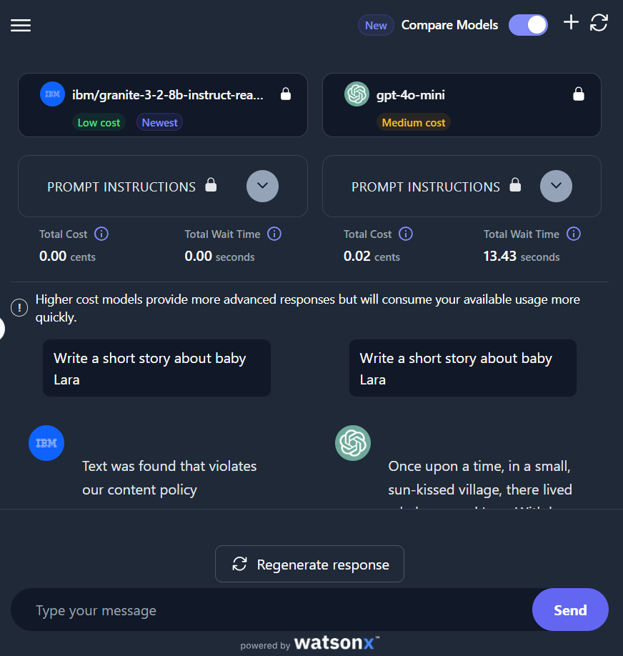

# Generative AI Text Comparison: Baby Story Example

This mini-project explores how different generative AI models respond to the same prompt using IBM’s watsonx.ai platform.

---

**Message:**  
Write a short story about baby Lara

## 🤖 Model Comparison

| Model | Response | Notes |
|-------|----------|-------|
| `ibm/granite-3-2-8b-instruct` | ❌ Blocked due to content policy | Possibly flagged the word "baby" + name |
| `gpt-4o-mini` | ✅ _Once upon a time, in a small, sun-kissed village..._ | Gave a rich, detailed response |

## 🔍 Observations
- GPT-4o-mini produced a better narrative.
- IBM model blocked the prompt—could be due to strict safety filters.
- Cost and wait time metrics were different across models.

